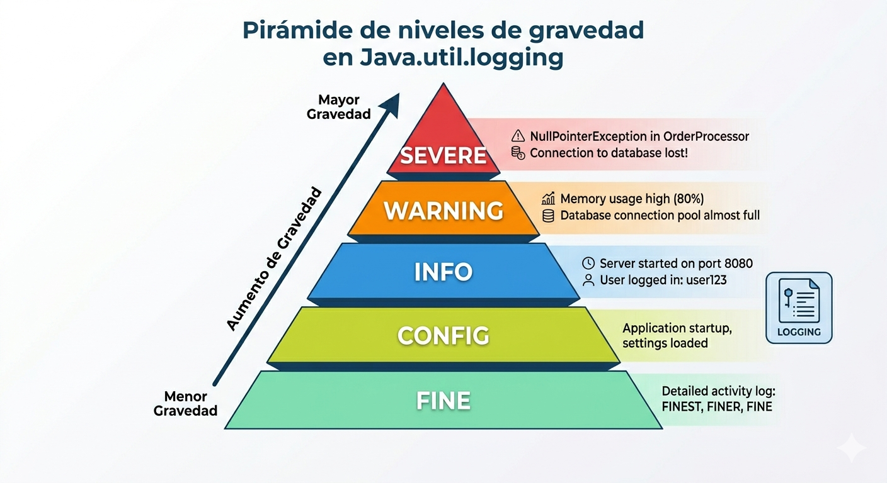
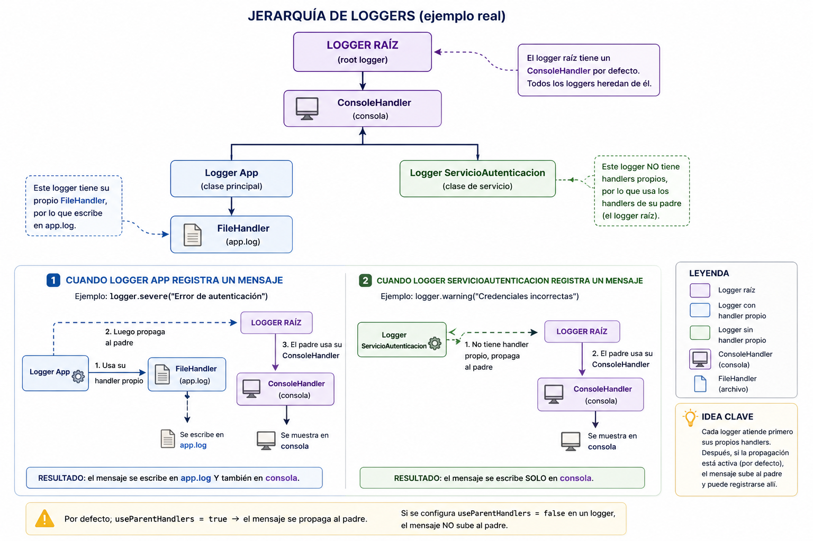

# Logs y Depuración con Java Util Logging

¡Hola a todos!

Están a punto de sumergirse en una clase que cambiará la forma en que observan y diagnostican el comportamiento de sus aplicaciones. Hasta ahora han aprendido a estructurar proyectos y manejar excepciones, lo cual es fundamental. Pero cuando una aplicación crece, usar solamente `System.out.println()` deja de ser suficiente.

Hoy aprenderán a registrar eventos importantes dentro de sus programas de manera ordenada y profesional, utilizando **java.util.logging**, la herramienta de logging incorporada en Java.

Esto les permitirá:

- comprender mejor lo que ocurre dentro de una aplicación,
- identificar errores con mayor facilidad,
- registrar eventos importantes,
- almacenar mensajes en archivos,
- y mejorar la mantenibilidad del software.

El logging no es solo imprimir mensajes: es una herramienta clave para desarrollar aplicaciones más profesionales, más fáciles de depurar y más fáciles de mantener.

---

# Objetivos de Aprendizaje

Al finalizar esta clase, serás capaz de:

- Comprender las limitaciones de `System.out.println()` para registrar eventos en aplicaciones reales.
- Entender la importancia del **logging** en el desarrollo y monitoreo de software.
- Utilizar **java.util.logging** para registrar eventos de una aplicación.
- Comprender y aplicar los niveles de log: `SEVERE`, `WARNING`, `INFO`, `CONFIG`, `FINE`.
- Configurar la salida de logs tanto en consola como en archivos usando `Handler` y `FileHandler`.
- Registrar excepciones correctamente utilizando logs.
- Diferenciar entre logging y depuración con debugger.

---

# 1. Las limitaciones de `System.out.println()`

Aunque `System.out.println()` es útil para pruebas rápidas, presenta varias limitaciones cuando una aplicación crece.

## Problemas principales:

### No permite clasificar mensajes
No diferencia entre:

- información,
- advertencias,
- errores.

Todo aparece igual en consola:

```java
System.out.println("Usuario autenticado");
System.out.println("Error al conectar");
```

No hay forma de saber cuál es informativo y cuál es crítico.

---

### No permite registrar en archivos fácilmente
`System.out.println()` solo imprime en consola.

En aplicaciones reales necesitamos conservar registros para análisis posterior.

---

### No agrega contexto automáticamente
No registra:

- fecha y hora,
- nivel de severidad,
- clase origen,
- método origen.

Con logging sí:

```java
INFO: Usuario autenticado correctamente
WARNING: Contraseña incorrecta
SEVERE: Error de conexión
```

---

### Manejo deficiente de excepciones
Con `println` normalmente solo se imprime el mensaje:

```java
System.out.println(e.getMessage());
```

Pero se pierde el detalle completo del error.

---

# 2. Importancia del Logging

El **logging** es el proceso de registrar eventos relevantes que ocurren durante la ejecución de una aplicación.

Permite:

- monitorear el sistema,
- detectar errores,
- analizar comportamientos,
- auditar procesos,
- depurar problemas.

## Ventajas del logging

### Trazabilidad
Permite saber qué ocurrió y cuándo ocurrió.

### Diagnóstico
Facilita encontrar errores.

### Persistencia
Los eventos pueden almacenarse en archivos.

### Mantenimiento
Permite entender el comportamiento del sistema sin detenerlo.

---

# 3. Introducción a `java.util.logging`

Java incorpora de forma nativa la API **java.util.logging**, que permite registrar mensajes clasificados por nivel y enviarlos a distintos destinos.

La idea es sencilla:

- el **Logger** genera mensajes,
- el **Handler** define dónde se escriben.

## Logger
Es el objeto que registra mensajes:

```java
Logger logger = Logger.getLogger(MiClase.class.getName());
```

## Handlers
Definen el destino del log:

- consola → `ConsoleHandler`
- archivo → `FileHandler`

---

# 4. Niveles de Logging

Los niveles permiten clasificar la gravedad de los mensajes.

## SEVERE
Errores graves:

```java
logger.severe("Error crítico en la aplicación");
```

## WARNING
Advertencias:

```java
logger.warning("Dato inválido detectado");
```

## INFO
Información general:

```java
logger.info("Usuario autenticado");
```

## CONFIG
Datos de configuración:

```java
logger.config("Puerto configurado en 8080");
```

## FINE
Detalles de depuración:

```java
logger.fine("Entrando al método login");
```
### La jerarquía de niveles 


---

# 5. Logging en Consola y Archivo

Con `java.util.logging` podemos registrar eventos en un archivo usando `FileHandler`.

```java
FileHandler archivo = new FileHandler("app.log", true);
logger.addHandler(archivo);
```

Esto genera un archivo con registros persistentes.

Ejemplo completo:

```java
Logger logger = Logger.getLogger("MiLogger");

FileHandler archivo = new FileHandler("app.log", true);
archivo.setFormatter(new SimpleFormatter());

logger.addHandler(archivo);

logger.info("Aplicación iniciada");
```

---

# 6. Logging de Excepciones

Una buena práctica es registrar errores cuando se capturan excepciones:

```java
catch (Exception e) {
    logger.severe("Error: " + e.getMessage());
}
```

Esto permite conservar evidencia de fallos.

Ejemplo:

```java
try {
    int resultado = 10 / 0;
} catch (ArithmeticException e) {
    logger.severe("Error al dividir: " + e.getMessage());
}
```

---
## Logging
Permite:

- registrar eventos,
- almacenar historial,
- diagnosticar errores en producción.

Se usa tanto en desarrollo como en producción.

### Ejemplo práctico: Sistema de autenticación con logs y manejo de excepciones


Crear un programa que:

* Solicite usuario y contraseña.
* Valide las credenciales.
* Registre eventos en consola y archivo.
* Lance excepciones cuando la autenticación falle.

#### 1. Excepción personalizada

```java
public class AutenticacionException extends Exception {
    public AutenticacionException(String mensaje) {
        super(mensaje);
    }
}
```
#### 2. Servicio de autenticación
```java
import java.util.logging.Logger;

public class ServicioAutenticacion {

    private static final Logger logger = Logger.getLogger(ServicioAutenticacion.class.getName());

    public void login(String usuario, String password) throws AutenticacionException {

        logger.info("Intentando autenticar usuario: " + usuario);

        if (usuario == null || password == null) {
            logger.warning("Usuario o contraseña nulos");
            throw new AutenticacionException("Datos de acceso inválidos");
        }

        if (!usuario.equals("admin") || !password.equals("1234")) {
            logger.warning("Credenciales incorrectas para usuario: " + usuario);
            throw new AutenticacionException("Credenciales incorrectas");
        }

        logger.info("Usuario autenticado correctamente: " + usuario);
    }
}
```
#### 3. Clase principal
```java
import java.io.IOException;
import java.util.Scanner;
import java.util.logging.FileHandler;
import java.util.logging.Logger;
import java.util.logging.SimpleFormatter;

public class App {

    private static final Logger logger = Logger.getLogger(App.class.getName());

    public static void main(String[] args) {

        try {
            FileHandler archivo = new FileHandler("app.log", true);
            archivo.setFormatter(new SimpleFormatter());
            logger.addHandler(archivo);

            ServicioAutenticacion servicio = new ServicioAutenticacion();

            Scanner sc = new Scanner(System.in);

            System.out.print("Usuario: ");
            String usuario = sc.nextLine();

            System.out.print("Contraseña: ");
            String password = sc.nextLine();

            servicio.login(usuario, password);

            System.out.println("Acceso concedido");

        } catch (AutenticacionException e) {
            logger.severe("Error de autenticación: " + e.getMessage());
            System.out.println("Acceso denegado: " + e.getMessage());

        } catch (IOException e) {
            logger.severe("Error al configurar archivo de logs");
            e.printStackTrace();
        }
    }
}
```

#### Resultado esperado en app.log
```text
INFO: Intentando autenticar usuario: admin
WARNING: Credenciales incorrectas para usuario: admin
SEVERE: Error de autenticación: Credenciales incorrectas
```


### Jerarquía de Loggers en el ejemplo


### Separar logs informativos y errores en dos archivos

```java
import java.io.IOException;
import java.util.logging.*;

public class App {

    private static final Logger logger = Logger.getLogger(App.class.getName());

    public static void main(String[] args) {

        try {
            // Archivo para mensajes informativos
            FileHandler infoHandler = new FileHandler("info.log", true);
            infoHandler.setFormatter(new SimpleFormatter());
            infoHandler.setLevel(Level.INFO);

            // Archivo para errores graves
            FileHandler errorHandler = new FileHandler("errores.log", true);
            errorHandler.setFormatter(new SimpleFormatter());
            errorHandler.setLevel(Level.SEVERE);

            logger.addHandler(infoHandler);
            logger.addHandler(errorHandler);

            logger.setUseParentHandlers(false);

            logger.info("Aplicación iniciada");
            logger.warning("El usuario ingresó un dato sospechoso");
            logger.severe("Error al conectar con la base de datos");

        } catch (IOException e) {
            System.out.println("Error al configurar logs");
        }
    }
}
```

### Personalizando nuestro propio Formatter 

``SimpleFormatter`` usa el formato estándar de Java.
Si queremos decidir cómo se ve cada log, creamos nuestro propio formatter

Se hace creando una clase que herede de Formatter.
```java
import java.util.logging.Formatter;
import java.util.logging.LogRecord;

public class MiFormato extends Formatter {

    @Override
    public String format(LogRecord record) {
        return "[" + record.getLevel() + "] " + record.getMessage() + "\\n";
    }
}
```
El parámetro `LogRecord record` contiene información como:

* nivel
* mensaje
* fecha
* clase
* método

Y tú decides cómo convertirlo en texto. En este caso:
```java
return "[" + record.getLevel() + "] " + record.getMessage() + "\\n";
```
genera:
```text
[INFO] Aplicación iniciada
```
Luego se usa en el handler:

```java
FileHandler archivo = new FileHandler("app.log", true);
archivo.setFormatter(new MiFormato());
```

Visualmente el flujo se ve así:
```text
Logger -> Handler -> Formatter -> Archivo
```